# 🎓 家校生伴学智能体 (AI-Tutor-Agent)

**[2025 阿里云-立信大学生竞赛 AI 创新赛（上海赛区）特等奖作品]**

一个基于 **阿里云百炼 (Aliyun Bailian)** 工作流编排与 **RAG** 技术构建的三方协同教育智能体。
采用独创的**“输入-决策-执行”三层架构**，解决传统教育 AI "缺乏情感关怀"、"交互模式单一"与"直接给出答案"的痛点。

[English](./README_EN.md) | [中文](./README.md)

---

## 📖 项目背景与痛点

当前 AI 教育工具普遍存在“直接给答案导致学生思维惰性”、“教师备课工具碎片化”、“家长辅导缺乏专业话术”等问题。
本项目旨在打造一个**全场景、多角色、高情商**的伴学智能体，通过**多模态识别**与**意图精准路由**，实现教育资源的精准匹配。

## 🏗️ 系统架构

本项目采用创新的 **三层分层架构**，实现了毫秒级路由与 100% 的角色匹配准确率：

1.  **输入处理层**：统一接收文字/图片输入，利用 **Qwen-VL** 进行多模态信息提取与变量聚合。
2.  **智能决策层**：引入**条件分支+角色预填写机制**，替代传统的 LLM 分类，大幅降低延迟。
3.  **执行输出层**：基于 **RAG 向量检索** 调用权威知识库，生成 Markdown、思维导图等多种格式。

> 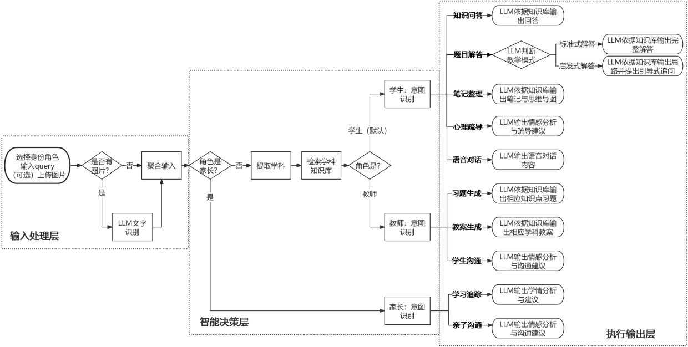

---

## ✨ 核心功能详解

### 👨‍🎓 1. 学生端：自主学习与成长伙伴

针对学生“不仅要答案，更要懂原理”的需求，我们设计了五大核心功能：

*   **🧠 题目解答（双模式切换）**
    *   **启发式教学模式**（默认）：拒绝直接给答案。通过多轮苏格拉底式提问，引导学生分步思考，培养独立解题能力。
    *   **标准解答模式**：当学生明确请求时，提供完整推导步骤与关键转折点解析。
    *   *创新点：支持中途动态切换模式，精准识别“教我做”与“给答案”的意图差异。*
    > 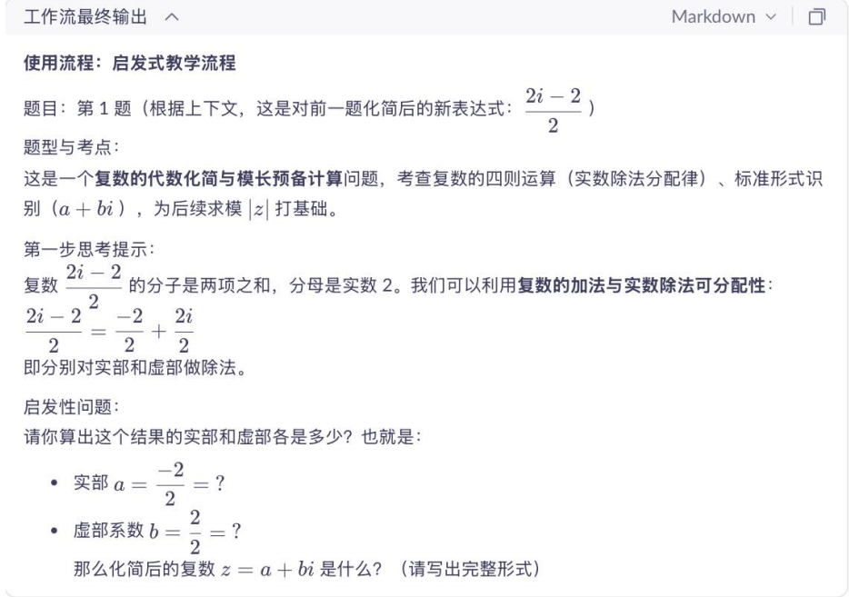

*   **📝 智能笔记整理 (Markdown + MindMap)**
    *   上传教材或手写笔记图片，自动提炼核心知识点、公式定理与易错点。
    *   **MCP 工具集成**：一键生成高清**思维导图**下载链接，助力知识体系构建。
    > 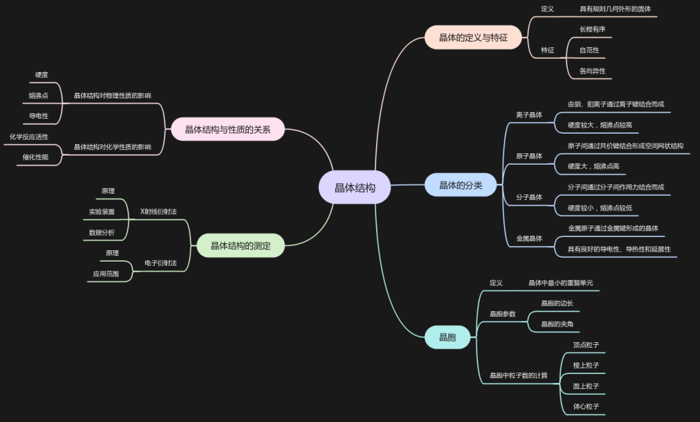

*   **❤️ 心理疏导与陪伴**
    *   扮演“伙伴”角色，提供非评判性的倾听空间。
    *   针对考试失利、人际矛盾等场景，提供情绪价值与心理建设建议。

*   **🗣️ 多语言口语陪练** & **📚 知识库问答 (RAG)**
    *   沉浸式口语练习环境，支持多语种自动纠错。
    *   基于校本知识库的精准问答，减少大模型幻觉。

---

### 👩‍🏫 2. 教师端：教学提效助手

为教师减轻机械性工作负担，专注于教学设计：

*   **📄 教案一键生成**
    *   输入教学主题（如“20分钟微型课”），自动生成包含教学目标、重难点、活动设计、板书设计的完整教案。
    *   支持根据学科特点（如物理实验、语文朗读）动态调整教学环节。
    > 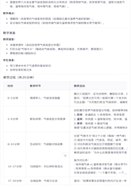

*   **✍️ 个性化习题定制**
    *   基于 RAG 检索教材知识点，生成原创习题。
    *   支持自定义难度、题型（选择/填空/简答）及是否附带解析。

*   **💬 学生行为分析与沟通指导**
    *   输入学生异常行为描述，系统基于教育心理学分析潜在成因（如自尊受损、家庭因素）。
    *   生成专业的**师生沟通话术**，建议干预策略。

---

### 👨‍👩‍👦 3. 家长端：家庭教育参谋

解决家长“辅导难、沟通难”的焦虑：

*   **🕊️ 亲子沟通指导 (NVC)**
    *   基于**非暴力沟通 (Non-Violent Communication)** 框架。
    *   针对孩子厌学、情绪爆发等场景，生成温和、无对抗的沟通脚本（观察-感受-需要-请求）。
    > 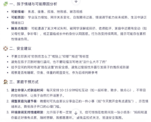

*   **📊 学习全维追踪**
    *   根据家长描述，自动生成结构化的**日报/周报**。
    *   可视化呈现孩子的难点、亮点及心理状态变化，提供下一阶段辅导建议。

---

## 💡 技术创新与优势

1.  **高精度意图识别**：在决策层末端进行意图识别，结合角色预设，准确率达 **95% 以上**。
2.  **RAG 知识增强**：引入教材/教辅向量库，显著降低通用大模型在学科知识上的幻觉率，确保内容的教育专业性。
3.  **Prompt Engineering**：针对不同角色精心设计的 **CoT (思维链)** 与 **Few-Shot** 提示词，确保输出符合教育规范（如不泄露答案、不进行医学诊断）。
4.  **低延迟体验**：通过逻辑分支优化，将非必要的大模型调用剥离，响应速度提升至 **5-20秒**。

---

## 🚀 使用指南 (Usage Guide)

请按照以下步骤在 **阿里云百炼平台** 部署并运行本项目：

### 1. 创建并导入智能体
*   登录 [阿里云百炼平台](https://bailian.console.aliyun.com/)，点击左侧菜单栏的 **“应用管理”**。
*   点击“创建应用”，选择 **“工作流应用”**。
    > 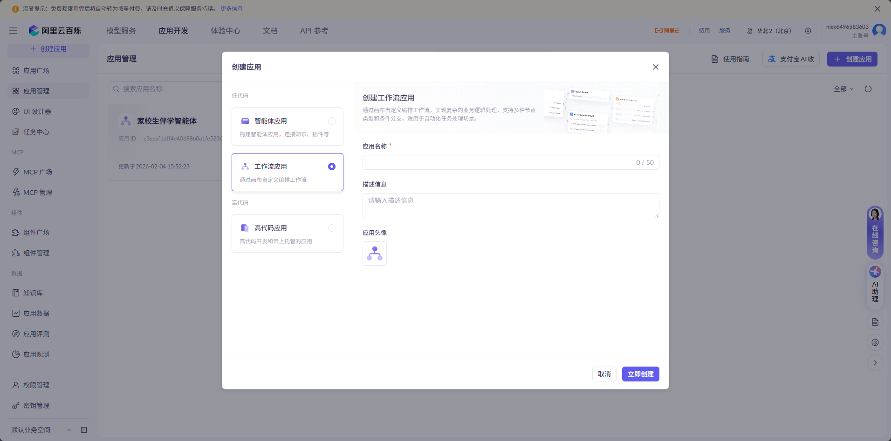
*   进入编排画布后，点击右上角的导入/导出按钮，选择 **“导入百炼 DSL/Zip”**。
*   上传仓库中的 `template.yml`。
    > 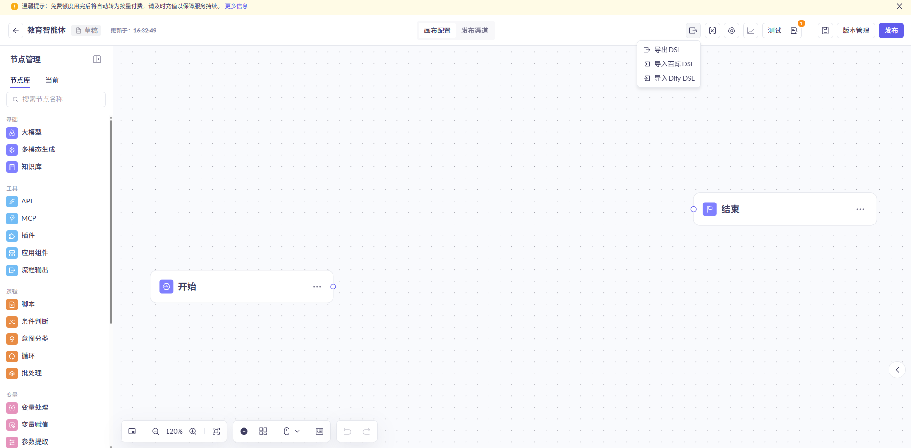

### 2. 构建知识库 (RAG)
*   点击左侧菜单栏的 **“知识库”**，点击 **“创建知识库”**。
    > 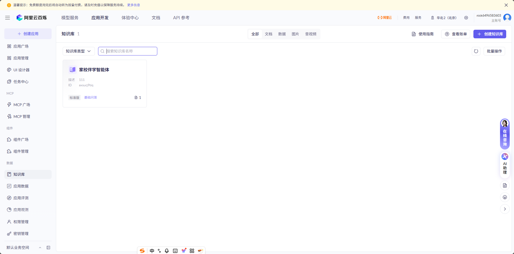
*   按照下图所示配置基础信息：
    > 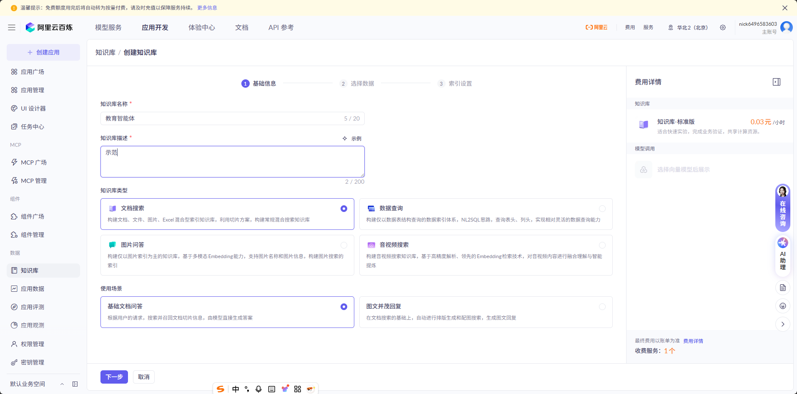
*   **上传资料**：导入本项目提供的相关教育资料或教材文档（可导入data_samples中的教材进行试验）。
    > 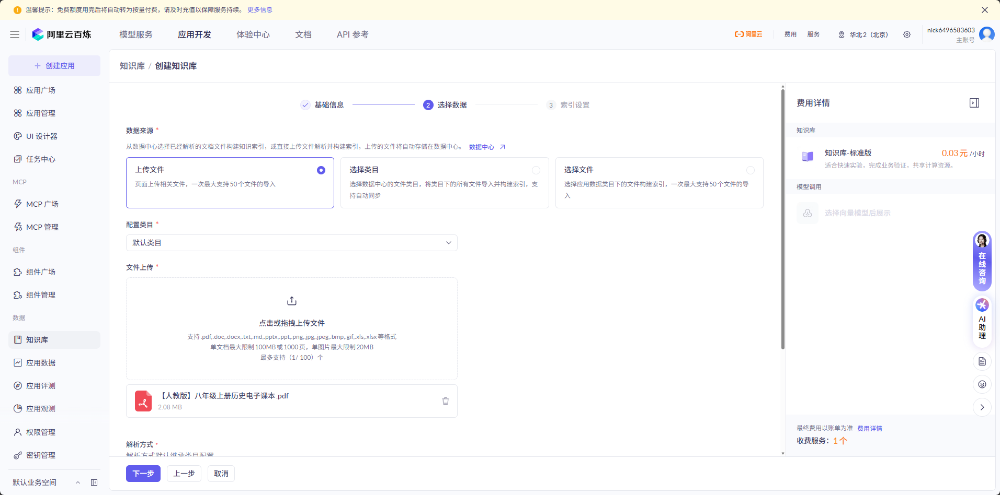
*   完成索引设置并点击“完成”：
    > 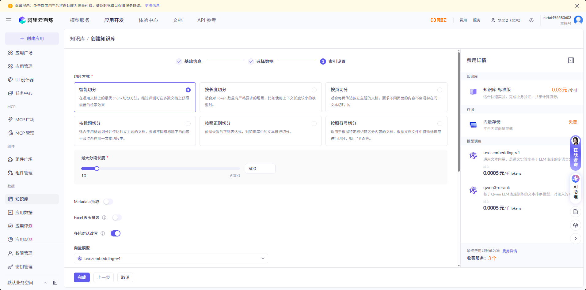
*   **等待解析**：等待文档状态显示为 **“解析完成”**。
    > 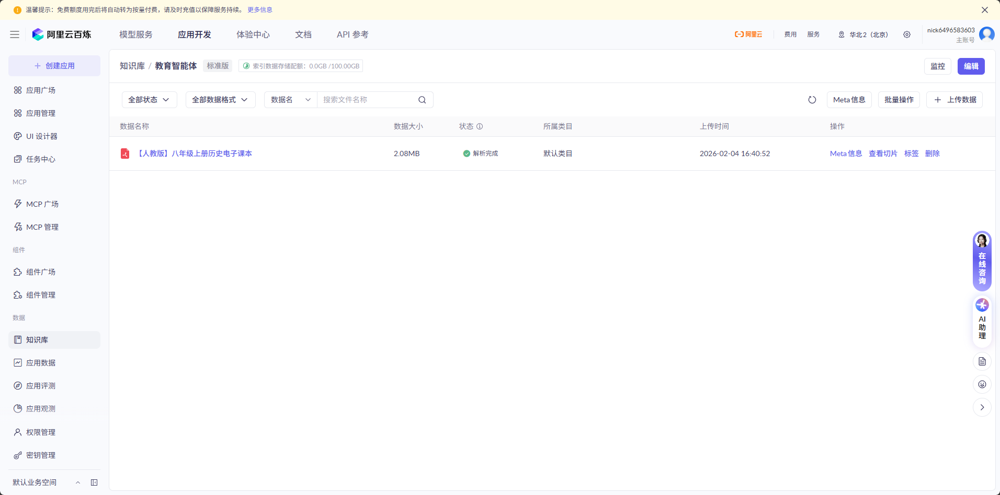

### 3. 关联知识库与智能体
*   回到智能体工作流画布，找到并点击 **“知识库检索”** 节点。
*   在右侧配置栏中，选择 **“智能调用”**。
*   点击下方“文档”区域，在弹窗中勾选你刚刚创建的知识库并确认。
    > 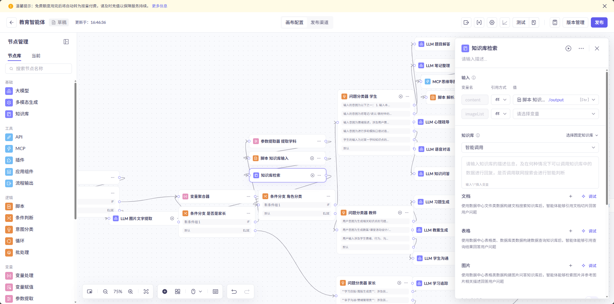
    > 

### 4. 开通思维导图插件 (MCP)
**本项目集成了 Edraw AI 用于生成思维导图，需手动开通权限：**
*   点击左侧菜单栏的 **“MCP 广场”**。
*   在搜索框输入“思维导图”，选择 **“Edraw AI”** 并点击 **“立即开通”**。
    > 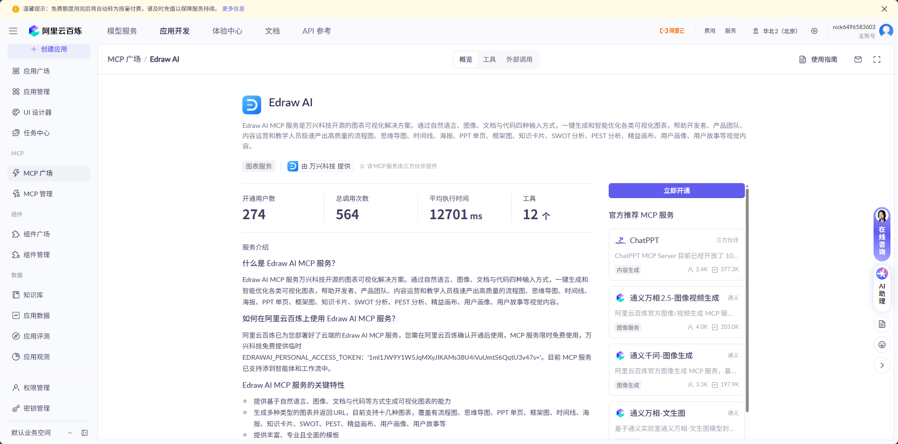
*   根据提示点击“确认开通”并完成授权。
    > 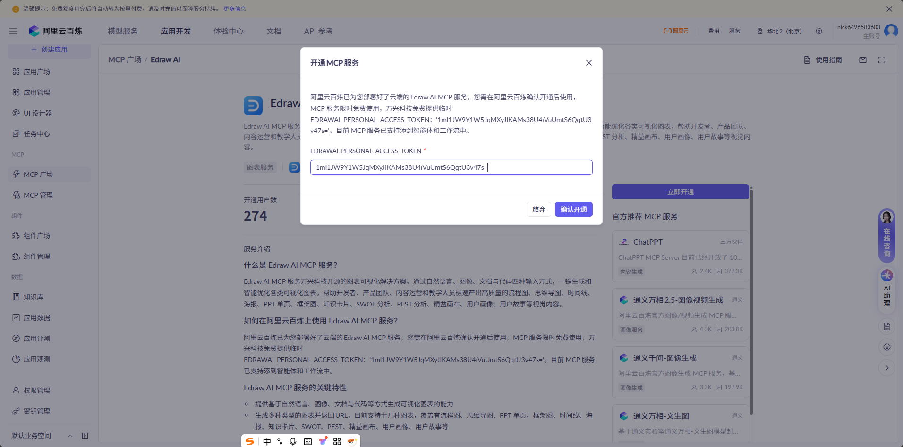

### 5. 调试与测试
*   点击画布右上角的 **“测试”** 按钮。
*   点击测试面板上方的 **“入参参数配置”** 按钮。
    > 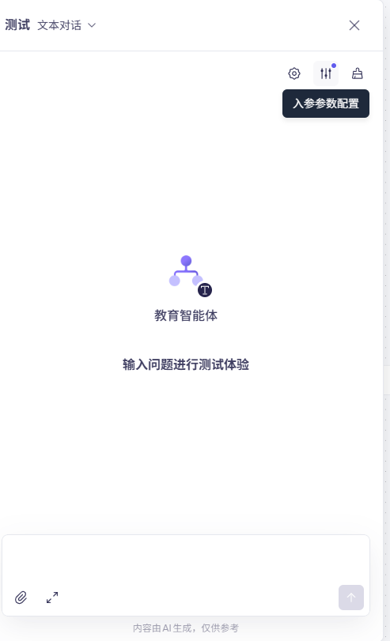
*   **输入变量**：在 `role` 字段中填入 **“学生”**、**“教师”** 或 **“家长”**。
    > 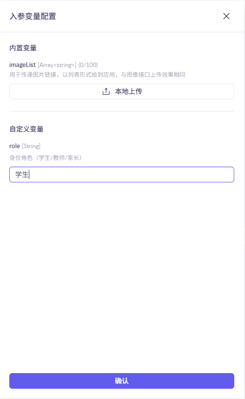
*   **开始对话**：在下方对话框输入问题（如“帮我写个教案”或“这道题怎么做”）。您可以通过左侧的节点流转状态实时检测逻辑运行是否正确。
    > 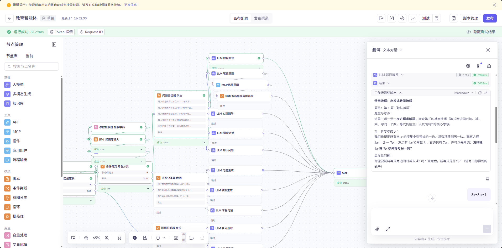

---

## 📂 核心 Prompt 展示

我们开源了项目中经过反复打磨的核心 Prompt，位于 `prompts/` 目录下：

| 场景 | 文件 | 核心策略 |
| :--- | :--- | :--- |
| **学生-解题** | [`student_heuristic_tutor.md`](prompts/student_heuristic_tutor.md) | 启发式引导、多轮追问、防泄题机制 |
| **家长-沟通** | [`parent_nvc_communication.md`](prompts/parent_nvc_communication_guide.md) | NVC 非暴力沟通框架、情绪共情 |
| **教师-教案** | [`teacher_lesson_plan.md`](prompts/teacher_lesson_plan_designer.md) | 结构化 Markdown 输出、教学法融入 |

## 🏆 荣誉
*   **特等奖** - 2025 阿里云-立信大学生竞赛 AI 创新赛（上海赛区）

